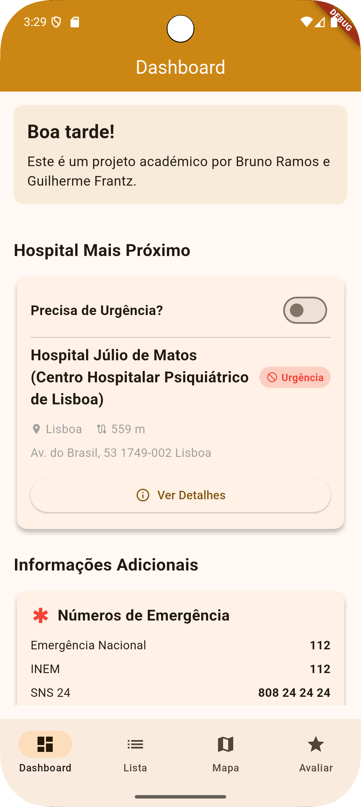
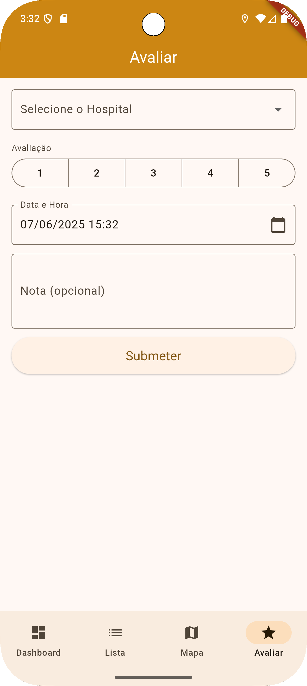
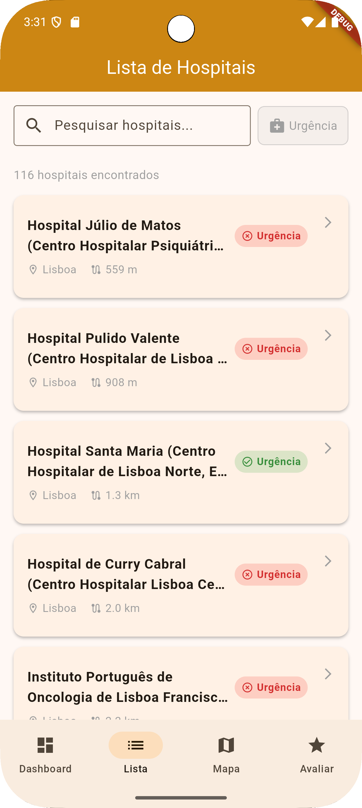
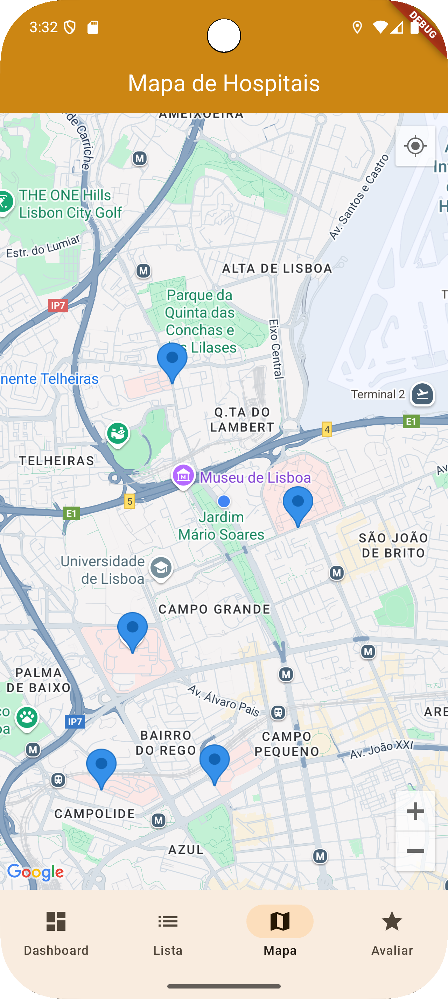

# Hospital Finder Mobile Application

This project is an academic endeavor developed as part of a Mobile Computing course. The "Hospital Finder" application aims to provide users with a convenient tool to locate nearby hospitals, access detailed information about their services, and submit evaluations based on their experiences. It's designed to be a practical and informative solution for navigating healthcare facilities efficiently.

## Implemented Functionalities

The application offers a comprehensive set of features to enhance the user experience:

### Highlights
* **Real-time User Location**: Continuously updates the user's current location.
* **Distance Calculation**: Calculates the distance between the user and hospitals.
* **Database Storage**: Stores data persistently in a local database.
* **Offline Access**: Ensures core functionalities are available even without an internet connection.
* **Hospital Evaluation**: Allows users to rate and provide feedback on hospitals.
* **Interactive Map**: Displays hospitals as pins on a map for easy visualization.

### Dashboard
* **Project Presentation**: An introductory section presenting the application.
* **Closest Hospital Display**: Shows the nearest hospital to the user.
    * Filter option for hospitals with or without emergency services.
    * Updated hospital information.
    * Direct link to hospital details.
* **Additional Information**: Displays emergency contact numbers.

### Hospital List
* **Hospital Search**: Enables searching for hospitals by name.
* **Emergency Filter**: Filters the list to show hospitals with or without emergency services.
* **Comprehensive List**: Provides a list of hospitals with updated information.
    * Direct link to hospital details.

### Hospital Map
* **User Location**: Pinpoints the user's location on the map.
* **Hospital Pins**: Displays hospitals as interactive pins on the map.
    * Provides information about the hospital upon selection.
    * Link to detailed hospital information.

### Hospital Evaluation
* **Evaluation Form**: A user-friendly form for submitting evaluations.
    * Input validation for required fields.
    * Stores evaluations in the database.

### Hospital Details
* **Updated Hospital Information**: Displays comprehensive and current information about a selected hospital.
    * Indication of emergency services (yes/no).
    * Name, address, contact number, and email.
    * Average rating and distance from the user.
* **Hospital Evaluations**: Shows a list of submitted evaluations for the hospital.
    * Includes date, rating, and comments.

---

## Getting Started

To get a local copy up and running, follow these simple steps.

### Prerequisites

* Ensure you have the Flutter SDK installed on your machine.
* A configured Android or iOS emulator/device.

### Installation

1.  **Clone the repository:**

    ```bash
    git clone [https://github.com/GuiFrantz/HospitalFinder.git](https://github.com/GuiFrantz/HospitalFinder.git)
    ```

2.  **Navigate to the project directory and install dependencies:**

    ```bash
    cd your-repository-name
    flutter pub get
    ```

3.  **Add Google Maps API Key:**
    You will need to provide your own Google Maps API key to use the map features.

    * Navigate to the file: `android/app/src/main/AndroidManifest.xml`
    * Find the following line (around line 8):

        ```xml
        <meta-data android:name="com.google.android.geo.API_KEY"
               android:value="API-KEY-HERE-REMOVED-FOR-SECURITY-REASONS"/>
        ```
    * Replace `API-KEY-HERE-REMOVED-FOR-SECURITY-REASONS` with your actual Google Maps API key.

4.  **Run the application:**

    ```bash
    flutter run
    ```

---

## Screenshots
<details>
<summary>Click to expand screenshots</summary>

### Dashboard


### Hospital Details


### Evaluate Hospital


### Hospital List


### Map


</details>

---

## Application Architecture and Logic

The application is designed with a **modular architecture** to facilitate easy modifications, bug fixes, and maintenance. It promotes code reusability and efficient state management.

### Architecture Overview
* **UI (User Interface)**: Handles all user interactions, including screens, buttons, and data presentation.
* **Logic Layer**: Centered around the **`SnsRepository`**, which manages all data actions related to hospitals. It decides whether to use online or offline data sources. Specific modules for connectivity and location handle their respective functionalities.
* **Data Layer**: Manages data persistence and retrieval, primarily through database storage, supporting both online and offline access modes.

### Key Classes and Components
The core business logic is encapsulated within the following classes:

#### Classes:
* `SnsRepository`
* `ConnectivityModule`
* `LocationModule`
* `SnsDataSource` (Interface/Abstract)
* `HttpSnsDataSource`
* `SqfliteSnsDataSource`
* `Hospital` (Data Model)
* `EvaluationReport` (Data Model)

#### Attributes:
* `SnsRepository`: `_sqfliteSnsDataSource`, `_httpSnsDataSource`, `_connectivityModule`, `_locationModule`, `hospitals`
* `LocationModule`: `_location`
* `HttpSnsDataSource`: `hospitalsList`
* `SqfliteSnsDataSource`: `_database`, `hospitals`
* `Hospital`: `id`, `name`, `description`, `longitude`, `latitude`, `address`, `phoneNumber`, `email`, `district`, `hasEmergency`, `reports`, `distance`
* `EvaluationReport`: `hospitalId`, `rating`, `dateTime`, `comment`

#### Methods:
* `SnsRepository`: `getAllHospitals()`, `getHospitalsByName(String name)`, `getHospitalDetailById(int hospitalId)`, `insertHospital(Hospital hospital)`, `deleteAll()`, `calculateDistance(Hospital hospital, LocationData currentLocation)`, `submitEvaluation(EvaluationReport evaluation)`
* `ConnectivityModule`: `checkConnectivity()`
* `LocationModule`: `_checkAndRequestPermission()`, `getCurrentLocation()`, `onLocationChanged()`, `calculateDistance(double startLatitude, double startLongitude, double endLatitude, double endLongitude)`
* `SnsDataSource`: `insertHospital(Hospital hospital)`, `getAllHospitals()`, `getHospitalsByName(String name)`, `getHospitalDetailById(int hospitalId)`, `attachEvaluation(int hospitalId, EvaluationReport report)`, `getHospitalWaitingTimes(int hospitalId)`, `insertWaitingTime(int hospitalId, dynamic waitingTime)`, `getHospitalEvaluations(int hospitalId)`
* `HttpSnsDataSource`: `insertHospital(Hospital hospital)`, `getAllHospitals()`, `getHospitalsByName(String name)`, `getHospitalDetailById(int hospitalId)`, `attachEvaluation(int hospitalId, EvaluationReport report)`, `getHospitalWaitingTimes(int hospitalId)`
* `SqfliteSnsDataSource`: `init()`, `attachEvaluation(int hospitalId, EvaluationReport report)`, `getAllHospitals()`, `getHospitalDetailById(int hospitalId)`, `getHospitalWaitingTimes(int hospitalId)`, `getHospitalsByName(String name)`, `insertHospital(Hospital hospital)`, `deleteAll()`, `getHospitalEvaluations(int hospitalId)`, `insertWaitingTime(int hospitalId, dynamic waitingTime)`
* `Hospital`: `factory Hospital.fromJSON(...)`, `factory Hospital.fromDB(...)`, `toDB()`
* `EvaluationReport`: `factory EvaluationReport.fromDB(...)`, `toDB()`

---

## Tech Stack
The application is built using:
* **Flutter**: For cross-platform mobile application development.
* **Sqflite**: For local database storage and offline data access.
* **Geolocator**: For location services and distance calculations.

---

## References
* Mobile Computing Course Slides
* Stackoverflow
* Flutter Documentation
* Geolocator Documentation